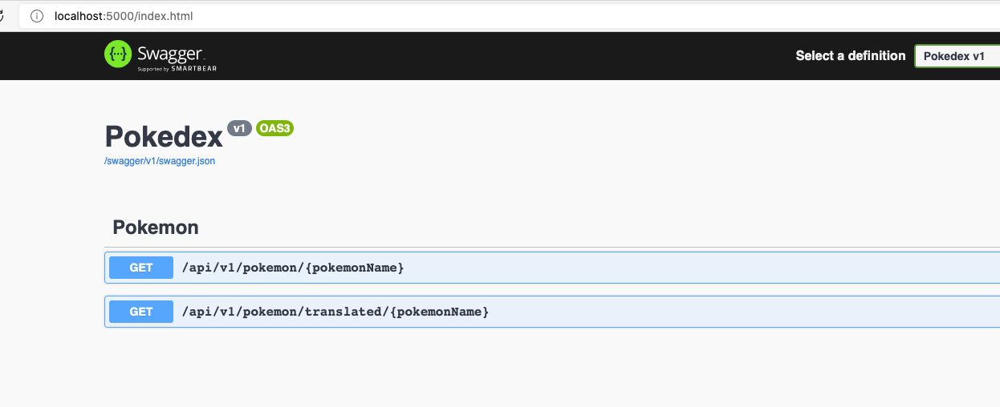

# Pokedex API
### Prerequisites
* [Git](https://git-scm.com/) - To clone the Pokedex API repo 🗄️
* [Docker Desktop](https://www.docker.com/get-started) - Container Technology 🐳
* Bash / [WSL 2](https://docs.microsoft.com/en-us/windows/wsl/install-win10) - To run `build-image.sh` 😄

### Quick Start
To run the Pokedex API:
1. Ensure you have installed the prerequisites by visiting the links above. You may need to add these tools to your PATH and/or restart your terminal.
2. Using your terminal, navigate to **OR** create a directory to clone the Pokedex API repo into
3. Inside the directory from step 2, use your terminal to run:
```    
    git clone https://github.com/DevTash/Pokedex.Api.git .
``` 
4. From the root of the project, use your terminal to run:
```
    bash build-image.sh
```
This will build the Pokedex API using Docker resulting in `pokedex-api:latest` image and tag.

5. Using your terminal, run:
```
    docker run --rm  -p 5000:5000/tcp pokedex-api:latest
```
This command will start a container based on the image we created in the previous step. `--rm` tells Docker to remove the container when we stop it using `Ctrl + c`.

6. Using your browser, navigate to: `http://localhost:5000`. You should be presented with Swagger UI



7. Go ahead, try it out 🥳

## Improvements
* Add integration tests to run during deployment
* Distributed caching for translations
* Deploy behind a load balancer to improve scalability and availability, possible ssl offloading
* Include infrastructure as code
* Implement some form of authentication (OAuth/OIDC, API Keys/Headers)
* Implement retries for external API calls using a library like Polly
* Possibly make the FunTranslation api endpoint configurable
* More logging for easier correlation
* Health check endpoint
* Rate limiting
* Dev Ops
* Allow locale to be passed via query string param
* Better utilization of SwaggerDoc